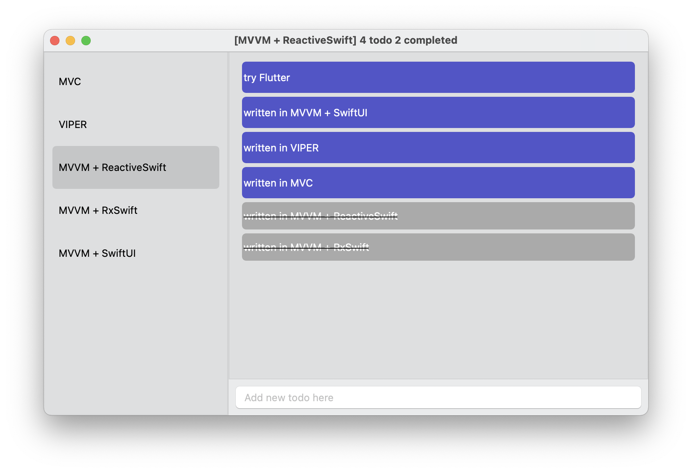

# Useful links

- [What is new is RxSwift5](https://freak4pc.medium.com/whats-new-in-rxswift-5-f7a5c8ee48e7)
- [Kickstarter iOS app](https://github.com/kickstarter/ios-oss)
- [Hacking with Swift](https://www.hackingwithswift.com/)
- [Sharing SwiftUI state with @ObservedObject](https://www.hackingwithswift.com/books/ios-swiftui/sharing-swiftui-state-with-observedobject)
- [Apple SwiftUI Tutorial](https://developer.apple.com/tutorials/swiftui)
- [SwiftUI tips and tricks](https://www.hackingwithswift.com/quick-start/swiftui/swiftui-tips-and-tricks)

- [Dart Programming Tutorial](https://www.tutorialspoint.com/dart_programming)
- [Flutter documentation](https://flutter.dev/docs)
- [Dart Language Samples](https://dart.dev/samples)

# MacOS

 
# Flutter

